# Delegation Lineage Diagram

This diagram shows how authority and responsibility flow from human intent to external side effects.

```mermaid
flowchart LR
    Human["Human\nsets intent\napproves scope"]
    Agent["Agent\nplans work\nchooses delegation"]
    SubAgent["Sub-Agent\nhandles bounded task"]
    Tool["Tool\nexecutes typed capability"]
    ExternalSystem["External System\nobserves side effect\nreturns response"]

    Human -->|delegates goal + constraints| Agent
    Agent -->|delegates subtask + budget| SubAgent
    SubAgent -->|invokes capability + inputs| Tool
    Tool -->|API call / file change / message| ExternalSystem
    ExternalSystem -->|response + external id| Tool
    Tool -->|tool result + evidence| SubAgent
    SubAgent -->|completion record| Agent
    Agent -->|answer + lineage summary| Human

    classDef principal fill:#e8f1ff,stroke:#2f6fed,stroke-width:1.5px,color:#172033;
    classDef execution fill:#edf8f0,stroke:#2c8a4a,stroke-width:1.5px,color:#172033;
    classDef external fill:#fff0f0,stroke:#d64545,stroke-width:1.5px,color:#172033;
    class Human,Agent,SubAgent principal;
    class Tool execution;
    class ExternalSystem external;
```

## Developer notes

- Each delegation hop should create or extend lineage metadata, not overwrite it.
- Sub-agents inherit constraints from the parent agent and may add stricter local constraints.
- Tool records should include the caller, delegated intent, input digest, output digest, and external reference when available.
- External system responses should be treated as evidence, not as trusted lineage by themselves.
