# Execution Path Diagram

This diagram follows a single action from an agent runtime request to a replayable archive record.

```mermaid
flowchart LR
    AgentRuntime["Agent Runtime\nreceives task + context"]
    JEPMiddleware["JEP Middleware\ncreates envelope\nattaches actor + intent"]
    ToolExecution["Tool Execution\nvalidates HJS\nruns selected tool"]
    Archive["Archive\nwrites JAC canonical record\ninputs + outputs + metadata"]
    Replay["Replay\nloads archive\nreconstructs execution path"]

    AgentRuntime -->|request action| JEPMiddleware
    JEPMiddleware -->|authorized tool call| ToolExecution
    ToolExecution -->|result + evidence| Archive
    Archive -->|canonical record id| Replay
    Replay -.->|debug / verify / reproduce| AgentRuntime

    classDef runtime fill:#edf8f0,stroke:#2c8a4a,stroke-width:1.5px,color:#172033;
    classDef middleware fill:#e8f1ff,stroke:#2f6fed,stroke-width:1.5px,color:#172033;
    classDef archive fill:#fff7e6,stroke:#d99000,stroke-width:1.5px,color:#172033;
    class AgentRuntime,ToolExecution runtime;
    class JEPMiddleware middleware;
    class Archive,Replay archive;
```

## Developer notes

- Middleware should be the narrow waist: every runtime action becomes a JEP envelope before tool execution.
- Tool execution should return enough evidence for replay without leaking unrelated runtime memory.
- Archive writes should happen on both success and failure so failed executions remain auditable.
- Replay should consume archive records instead of calling live tools unless a developer explicitly starts a re-execution mode.
