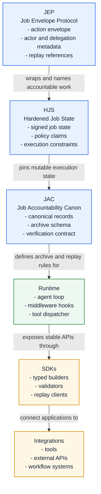

# Protocol Stack Diagram

This diagram shows the layer order developers should preserve when adding runtime features or integrations.

## Developer notes

- Keep protocol data models (`JEP`, `HJS`, `JAC`) independent from runtime implementation details.
- Runtime code should depend on protocol contracts, not on a specific SDK or integration.
- SDKs should make valid envelopes easy to build and invalid state hard to submit.
- Integrations should be replaceable as long as they preserve tool input, output, and lineage records.
