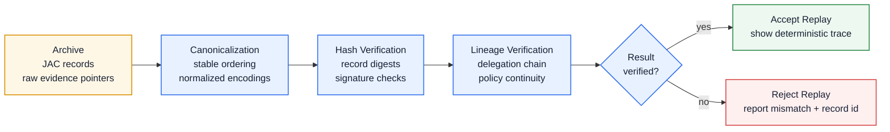

# Replay Verification Diagram

This diagram shows the verification path before a replay result is accepted as trustworthy.

## Developer notes

- Canonicalization must happen before hashing; otherwise equivalent records can produce different digests.
- Hash verification answers whether stored content changed.
- Lineage verification answers whether the delegation chain and policy claims still make sense together.
- Rejected replays should produce actionable diagnostics: failed stage, expected digest, actual digest, and affected record id.
