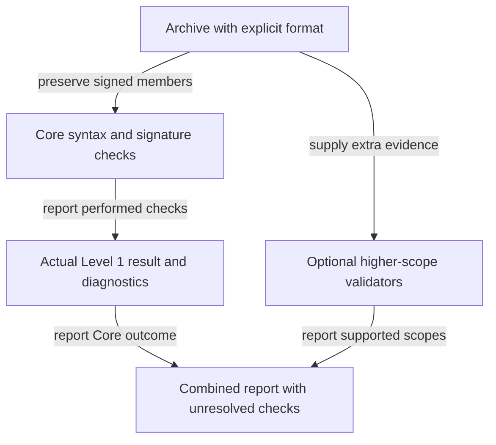

# Scoped verification result

Core canonicalization and trusted-key signature verification follow JEP rules. The current reference API returns Level 1; it does not implement the optional higher-scope box. HJS/JAC, identity, authority and completeness claims require additional validators and evidence. Never normalize signed payloads with an unrelated JSON format.
