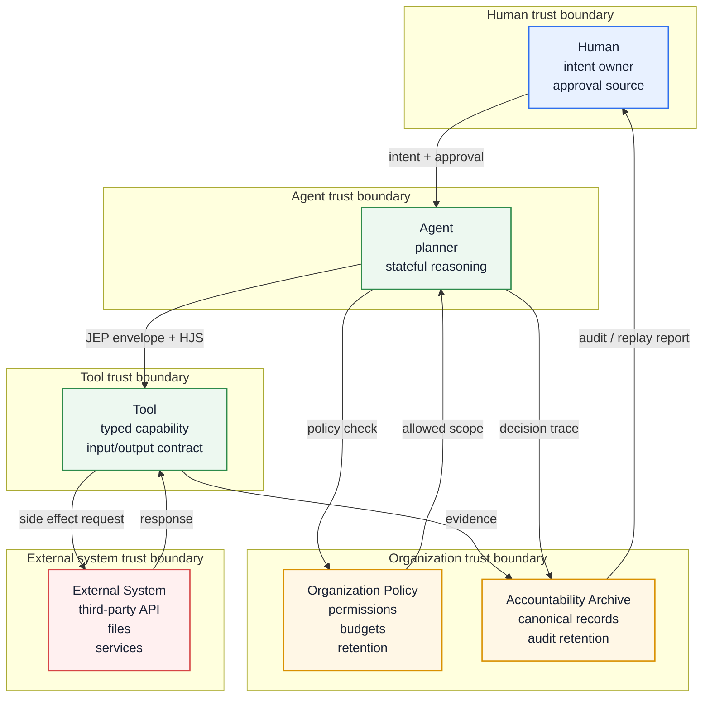

# Trust Boundary Diagram

This diagram separates the principals and systems that participate in an accountable action.

## Developer notes

- Do not assume agent memory, organization policy, tool code, and external systems share a trust boundary.
- Policy decisions should be recorded with the action they authorize.
- Tool outputs need validation before they become agent context.
- External system identifiers are useful for audit correlation, but they should not replace canonical archive ids.
